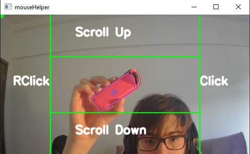

# mouseHelper

>Software de acessibilidade para controlar o mouse a partir da webcam.

## Pré-requisitos
- Python3
- OpenCV para Python
- Webcam
- Objetos com cores claras e saturadas, dentro da palheta de cores

## Descrição Longa
O projeto mouseHelper mira desenvolver um programa em Python e OpenCV que consiga melhorar a acessibilidade em computadores. A ideia do programa é usar a webcam e objetos para controlar o ponteiro do mouse e seus controles (Scroll e Clique).\
O usuário pode escolher a cor do objeto que irá controlar o ponteiro e a cor do objeto que irá controlar os comandos do mouse. As cores possíveis foram escolhidas anteriormente para poder garantir que seu rastreamento está balanceado.\
A filtragem dos objetos de acordo com as cores usa a representação HSV, pois assim, o programa pode separar corretamente objetos de cores próximas. O sistema RGB não foi utilizado pois certas cores iriam causar interferência em outras. Por exemplo, certos tons de Laranja, no sistema RGB, ativam a cor Vermelha tanto quanto o próprio Vermelho.\
Para o rastreamento dos objetos, foi usado o Camshift, para poder redimensionar a janela de rastreamento corretamente a cada movimento. O programa mouseHelper irá desenhar em volta de cada objeto um retângulo, e no centro desse retângulo, um círculo, que será usado como referência.
#### Comandos do Mouse
Os comandos do mouse são feitos quando um objeto da cor escolhida para os controles se posiciona em cima do setor do comando. Com o Clique principal do lado direito da imagem, Clique Secundário do lado esquerdo, Scroll Up em cima e Scroll Down embaixo, o usuário pode fazer um comando por vez.
#### Ponteiro
O ponteiro do mouse será posicionado na tela proporcionalmente no mesmo local que o centro do objeto da cor escolhida para controle do ponteiro estiver na imagem. Exemplo: se o objeto que controla o mouse estiver no primeiro quadrante da imagem, o ponteiro real do mouse estará localizado no ponto equivalente do primeiro quadrante do monitor.
### Ajustes e Melhorias

- [X] Unificação do rastreamento do ponteiro e dos controles
- [X] Melhoria no tempo de resposta
- [X] Resolução do conflito entre objetos de diferentes cores
- [X] Palheta básica de cores (Vermelho, Azul, Verde, Amarelo e Rosa)
- [ ] Rastreamento de objetos específicos, sem a necessidade de cores saturadas
- [ ] Melhoria na codificação do tamanho da tela e do tracker (está hard-coded)
